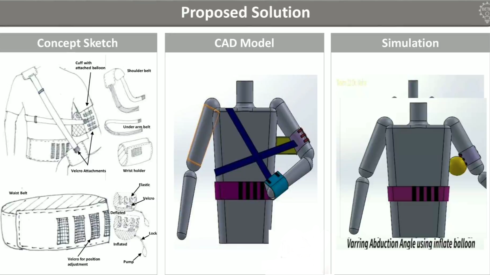

# ir-health-monitor

## Overview

**ir-health-monitor** is a cost-effective health monitoring system integrated into an adjustable shoulder brace for post-surgery recovery. It uses an ESP32 microcontroller to read physiological data from two sensors:

- **SparkFun MAX30102**: Measures blood oxygen saturation (SpO2) and breath rate.
- **SparkFun MLX90640**: Measures skin temperature using a thermal array sensor.

The ESP32 processes sensor data and sends it via WiFi to a remote server for monitoring and analysis.

---

## Features

- Real-time monitoring of SpO2, breath rate, and skin temperature.
- Wireless data transmission to a server using HTTP POST requests.
- Compact and low-power design suitable for wearable medical devices.
- Easy integration with post-surgery shoulder braces to support recovery.

---

## Components

- **ESP32** development board (microcontroller and WiFi).
- **SparkFun MAX30102** sensor (pulse oximetry and respiration).
- **SparkFun MLX90640** sensor (infrared thermal camera for skin temperature).
- Power source and shoulder brace hardware (not covered in code).

---

## Hardware Setup

1. Connect MAX30102 sensor to ESP32 (SDA, SCL, power, ground).
2. Connect MLX90640 sensor to ESP32 via I2C (SDA, SCL, power, ground).
3. Ensure ESP32 has internet access for server communication.

---

## Software Setup

1. Install Arduino IDE and add ESP32 board support.
2. Install required libraries:
   - SparkFun MAX3010x Sensor Library
   - MLX90640 Library by Pololu
3. Configure WiFi credentials and server URL in the code.
4. Upload `esp32_spo2_skinTemp_breath_monitor.ino` to ESP32.

---

## Usage

- Power the device and wait for WiFi connection.
- Sensor data will be read every 5 seconds.
- Data is sent as JSON via HTTP POST to your specified server endpoint.
- Monitor health data remotely for recovery progress tracking.

---

## Example JSON Payload

```json
{
  "irValue": 123456,
  "redValue": 789012,
  "skinTemp": 33.45
}
```
© 2021 ir-health-monitor team. Developed for the medical hackathon - eMedha 2021 competition.  
**Use this project only for educational purposes.**